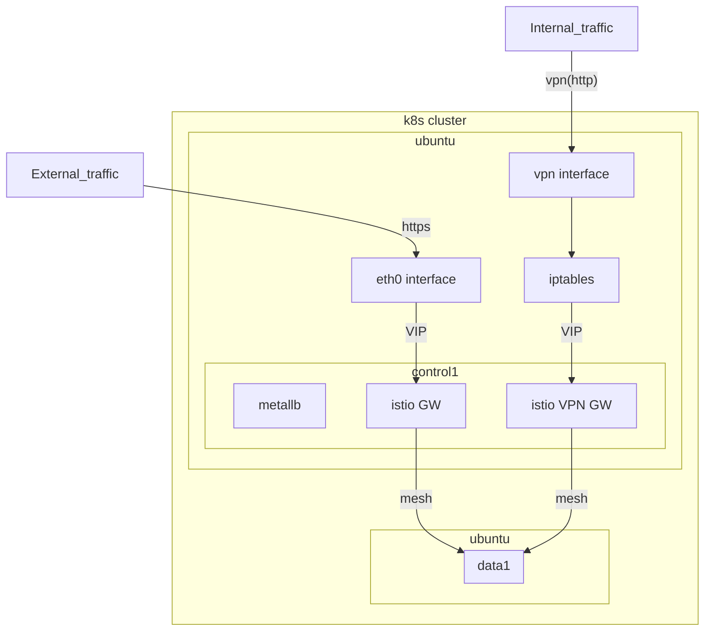

# k8s provisioning

### Network architecture



### cluster-setup
- infrastructure
    - helmfile 기반 구성
    ```
    helm plugin install https://github.com/databus23/helm-diff
    ```
- network
    - calico의 경우 kubectl/ calicostl patch 작업이 필요함
        - 기본 네트워크 구성은 eth0(기본인터페이스)를 사용하고, 원격 노드의 경우에만 spec.BGP에 ip를 명시해서 사용? -> 테스트 필요
    - cilium
        - tunnel, native
            - 연결 완료 시 클러스터 고립되는 문제 (cilium-agent랑 apiserver랑 연결이 안되는 듯)
            - 클러스터 구성이나 네트워크 인터페이스가 여러개라 발생하는 문제 같기도함 (추가 확인이 더 필요)


### gitops
- fluxcd가 관리하는 리소스

### ops-manual
- 명령어로 진행한 작업 기록