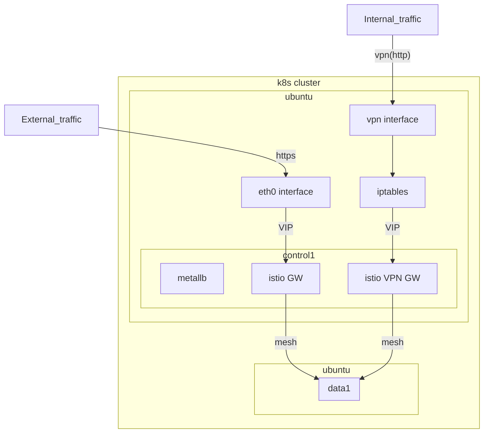

### 현재 네트워크 구성에서 외부 노드 추가 클러스터링 시 문제점
 
아래 구성도에서 외부 이더넷 대역의 인터페이스는 Proxmox VM들의 대역이고, 외부 트래픽을 유입받는 엣지 영역의 엔드포인트가 같은 대역에 속해있음 (해당 진입점에서 클러스터의 GW로 라우팅됨)

현재 구성된 k8sm1 노드와 k8sw1 노드는 같은 대역에 속해있어 클러스터링에 문제가 없지만, 리소스 부족으로 노드 추가 시엔 같은 대역에 속하지 않을 수 있어 join 후 통신에 문제가 있을 수 있을 듯 함

- 기존 kube-apiserver의 advertise-address는 192.168.11.x, VPN 대역은 100.122.x.x
- k8sm1 (192.168.11.100), k8sw1 (192.168.11.101), k8sw2 (100.122.123.102) 라고 가정하면 통신을 위한 네트워크는 구성이 되어 있지만, 클러스터에서 인식이 안될 듯





예상 해결 방법은 아래처럼 `/etc/kubernetes/manifests/kube-apiserver.yaml` 에 advertise-address ip를 추가해주는 거
```sh
kubeadm init \
  --apiserver-advertise-address=0.0.0.0 \
  --apiserver-cert-extra-sans "192.168.0.100,100.122.123.100"
```

근데 내 구성에선 외부에서 lens 연결 하려고 구성해둔 `/etc/kubernetes/kube-config.yaml`가 있어서 아래처럼 수정해주면 될 듯 함
```yaml
apiVersion: kubeadm.k8s.io/v1beta3
kind: ClusterConfiguration
kubernetesVersion: v1.30.14
apiServer:
  certSANs:
    - k8sm1.avgmax.in # VPN용 내부 도메인
    - 100.122.123.100
    - 192.168.11.100   # 여기에 LAN IP 추가
  extraArgs:
    advertise-address: "0.0.0.0"
```
